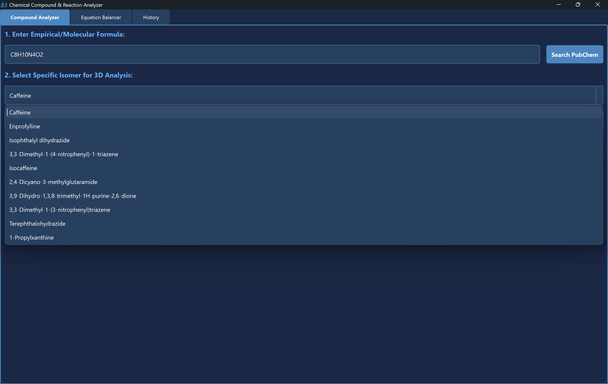
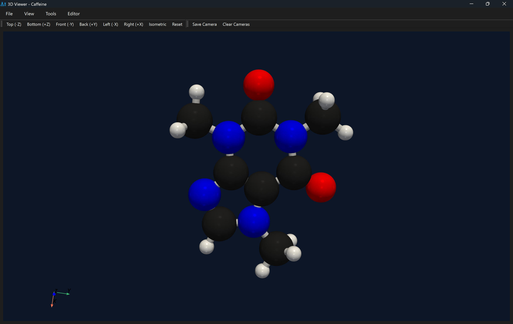
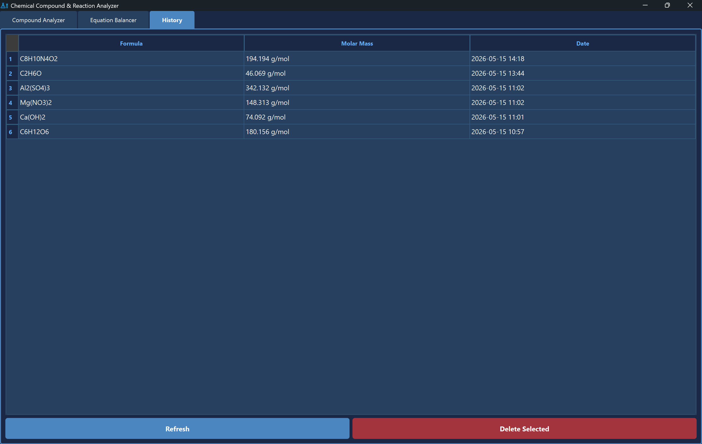

---

# ChemAnalyzer: Advanced Chemical Compound & Reaction Analyzer

## 1. Overview

**ChemAnalyzer** is a high-performance desktop application designed for chemists and researchers to bridge the gap between empirical formulas and structural analysis. Built with a robust **Model-View-Controller (MVC)** architecture, the application performs complex molecular parsing, balances chemical equations using linear algebra, and renders interactive 3D molecular structures via the PubChem REST API.


*Figure 1: The Isomer resolution engine and search interface.*

---

## 2. Core Technical Features

### Recursive Descent Molecular Parsing

The engine utilizes a custom-built recursive descent parser to handle molecular formulas. Unlike basic regex-based tools, this parser correctly interprets infinitely nested parentheses and complex multipliers (e.g., `[Fe(CN)6]4-` or `Al2(SO4)3`), distributing atomic counts with mathematical precision to calculate molar mass.

### Linear Algebra Equation Balancing

The balancing engine treats chemical reactions as systems of linear equations. It constructs a stoichiometric matrix and utilizes **Singular Value Decomposition (SVD)** via `NumPy` to find the null space. This ensures that even the most complex redox reactions are balanced to their simplest integer coefficients instantly.

### Asynchronous 3D Visualization

To resolve isomer ambiguity, ChemAnalyzer performs a two-stage fetch from the **NIH PubChem API**:

1. **Search:** Finds all Compound IDs (CIDs) matching an empirical formula.
2. **Fetch:** Retrieves the specific V2000 SDF (Structure-Data File) 3D coordinate block.
3. **Render:** Generates a CPK-colored ball-and-stick model using the **PyVista** OpenGL engine.


*Figure 2: Interactive 3D rendering of Caffeine (C8H10N4O2) generated from NIH PubChem coordinates.*

### Relational Database Persistence

All analyzed compounds are persisted in a local **SQL Server** instance via `pyodbc`. The app features a dynamic History tab that allows users to review, refresh, or delete previous calculations, ensuring data remains accessible between sessions.


*Figure 3: Relational database view featuring a clean, dark-themed history manager.*

---

## 3. Tech Stack

* **Language:** Python 3.10+
* **UI Framework:** PyQt6 (Custom CSS Dark Theme)
* **Mathematical Engines:** NumPy (SVD), Custom Recursive Parser
* **3D Rendering:** PyVista & PyVistaQT (VTK-backend)
* **Database:** Microsoft SQL Server & pyodbc
* **API Integration:** PubChem PUG REST API
* **Quality Assurance:** Pytest (Unit Testing)

---

## 4. Installation & Setup

### 1. Clone the Repository

```bash
git clone https://github.com/yourusername/ChemAnalyzer.git
cd ChemAnalyzer

```

### 2. Set Up Virtual Environment

```bash
python -m venv .venv
# Windows
.venv\Scripts\activate
# Mac/Linux
source .venv/bin/activate

```

### 3. Install Dependencies

```bash
pip install -r requirements.txt

```

### 4. Database Configuration

Ensure you have SQL Server installed and running locally. Run the following SQL script to initialize the database:

```sql
CREATE DATABASE ChemAnalyzerDB;
GO
USE ChemAnalyzerDB;
CREATE TABLE Compounds (
    CompoundID INT IDENTITY(1,1) PRIMARY KEY,
    Formula NVARCHAR(100) NOT NULL,
    MolarMass DECIMAL(10, 3) NOT NULL,
    DateAdded DATETIME DEFAULT GETDATE()
);

```

---

## 5. Usage

1. **Launch the App:** Run `python main.py` from your terminal.
2. **Compound Analysis:** Enter a formula (e.g., `C2H6O`), search PubChem, and select the specific isomer to calculate molar mass and launch the 3D viewer.
3. **Equation Balancing:** Navigate to the "Equation Balancer" tab and enter a reaction in the format `CH4 + O2 = CO2 + H2O`.
4. **Data Management:** Use the "History" tab to view past analyses or clear the database.

---

## 6. Running Tests

This project uses `pytest` to ensure the mathematical accuracy of the parsing and balancing engines.

```bash
pytest -v

```

---

## 7. Project Structure

```text
ChemAnalyzer/
├── main.py                # Application entry point
├── requirements.txt       # Dependency list
├── .gitignore             # Git exclusion rules
├── assets/                # Images and application icons
├── tests/                 # Unit tests (Pytest)
│   └── test_controller.py
└── app/
    ├── controller.py      # Main MVC Orchestrator
    ├── models/            # Core business logic (Parser, 3D, DB)
    │   ├── balancer.py
    │   ├── db_manager.py
    │   ├── visualizer.py
    │   └── molecule_fetcher.py
    └── views/             # PyQt6 GUI layouts and styles
        └── main_window.py

```

---
